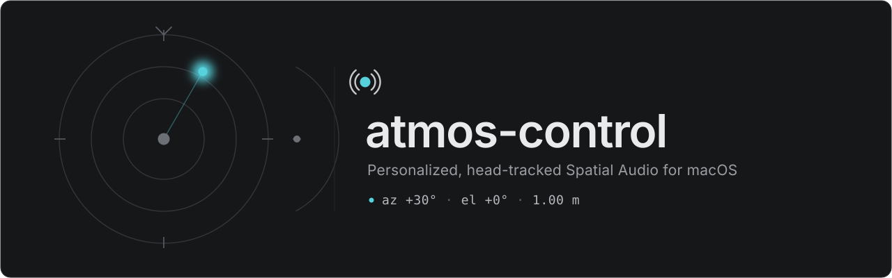
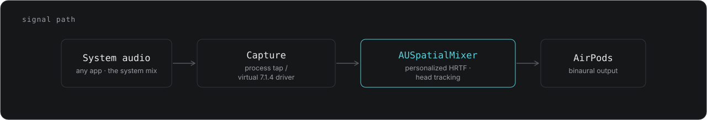
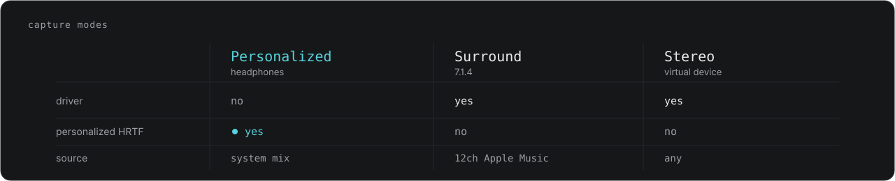
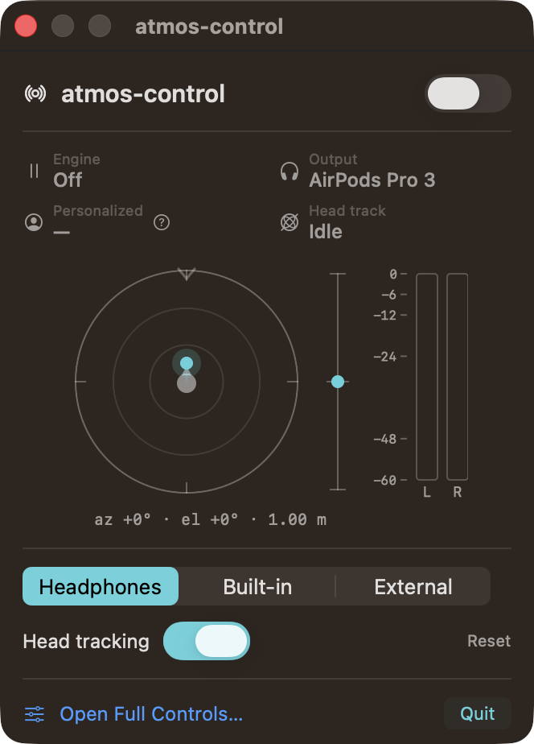
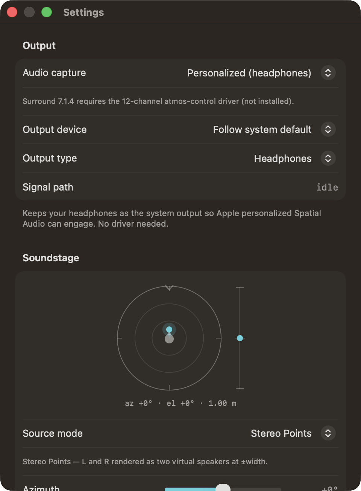

<p align="center">
  
</p>

<p align="center"><a href="README.md">English</a> | Русский</p>

# atmos-control

**Персонализированное пространственное аудио для macOS** — системный, бинауральный звук с
отслеживанием положения головы и полной ручной панелью управления собственным пространственным
рендерером Apple (`AUSpatialMixer`). Приложение живёт в строке меню и в реальном времени
пространственно обрабатывает всё, что воспроизводит ваш Mac, отправляя результат в наушники — с
персонализированным HRTF и отслеживанием головы для AirPods. Оно сделано для тех, кто уже разбирается
в пространственном аудио и хочет получить те регуляторы рендерера, которые система прячет: тип вывода,
алгоритм спатиализации, азимут/высоту/дистанцию/усиление каждого источника, режим HRTF и отслеживание
головы.

atmos-control — это **не** декодер Dolby Atmos. Это PCM-спатиализатор и апмиксер стерео/surround,
работающий на том же DSP-движке Apple, что и системное Spatial Audio. Ключевое отличие в одном
предложении: он даёт ручное управление пространственным рендерером Apple — с персонализированным HRTF
и отслеживанием головы — вместо единственного системного переключателя «вкл/выкл».

## Как это работает

atmos-control захватывает системный звук, подаёт его во встроенный в приложение `AUSpatialMixer` и
отправляет пространственно обработанный бинауральный результат в наушники. Микшер — это тот же движок
Apple, что стоит за системным Spatial Audio, поэтому с AirPods и отсканированным персональным профилем
включаются персонализированный HRTF и отслеживание головы, а atmos-control раскрывает всю поверхность
рендерера, которую Apple обычно сводит к одному переключателю.

<p align="center">
  
</p>

1. **Захват** — системный микс читается через process tap (по умолчанию) либо направляется через
   виртуальное аудиоустройство atmos-control (режимы loopback).
2. **Спатиализация** — каждый канал или источник размещается по своему азимуту, высоте и дистанции и
   рендерится через `AUSpatialMixer` Apple (персонализированный HRTF, когда он доступен, иначе —
   универсальный HRTF).
3. **Отслеживание** — с AirPods положение головы обновляется непрерывно, поэтому сцена остаётся
   зафиксированной в пространстве, пока вы поворачиваете голову.
4. **Вывод** — бинауральный результат воспроизводится в наушниках. Никуда ничего не отправляется; весь
   захват и обработка происходят локально.

## Режимы захвата

atmos-control предлагает три способа подать звук в движок. Режим **Personalized** по умолчанию не
требует драйвера и является единственным, где может включиться персонализированный HRTF; два режима
loopback требуют опционального виртуального аудиоустройства.

<p align="center">
  
</p>

| Режим | Что делает | Нужен драйвер | Системное Spatial Audio | Dolby Atmos в Apple Music |
|---|---|---|---|---|
| Personalized (наушники) | Захватывает системный микс через process tap и применяет персонализированный бинауральный рендеринг с отслеживанием головы. Режим по умолчанию. | Нет | Off | Off |
| Surround 7.1.4 | Проводит настоящие 12 каналов через виртуальное устройство и размещает каждый канал под его каноническим углом акустической системы. | Да | Off | Automatic |
| Stereo (виртуальное устройство) | Направляет весь звук через виртуальное устройство atmos-control. Работает с любым источником, но рендеринг универсальный (персонализированный HRTF включиться не может). | Да | Off | Off |

Примечания:

- Режим Personalized по умолчанию не требует драйвера. Драйвер нужен только для Surround 7.1.4 и
  Stereo (виртуальное устройство), поскольку они захватывают через виртуальное устройство вывода.
- Персонализированный HRTF включается только в режиме Personalized с AirPods, у которых есть
  отсканированный персональный профиль. Панель показывает статус «Personalized», который читается как
  активный, когда движок Apple подтверждает использование вашего персонального HRTF.

## Скриншоты

<p align="center">
  
</p>

Компактная панель в строке меню: переключатель питания, строка живого статуса (движок, устройство
вывода, персонализированный HRTF, отслеживание головы), пространственный визуализатор (радар азимута +
шкала высоты), стереометры и быстрые регуляторы.

<p align="center">
  
</p>

Окно настроек: полная поверхность рендерера — устройство вывода и алгоритм, перетаскиваемый источник
сцены с азимутом/высотой/дистанцией/усилением, регуляторы персонализации и отслеживания головы, флаги
рендеринга и полные метры.

## Требования

- Mac на Apple Silicon (arm64).
- macOS 26 (Tahoe) или новее.
- Инструменты командной строки Xcode (`xcode-select --install`) — дают `swift`.
- AirPods Pro (с отсканированным персональным профилем Spatial Audio) для персонализированного
  режима с отслеживанием головы. Любые наушники работают с универсальным HRTF.

## Установка

Клонируйте репозиторий и запустите установщик:

```bash
git clone <repo-url> atmos-control
cd atmos-control
./install.sh
```

`install.sh` идемпотентен — повторный запуск пересобирает и заменяет установленное приложение.
Он собирает пакет, формирует `dist/atmos-control.app` и копирует его в `/Applications`. Он никогда не
меняет ваше устройство вывода по умолчанию и не трогает системные аудио-расположения.

Чтобы также установить опциональный аудиодрайвер (нужен только для двух режимов loopback — см. раздел
«Режимы захвата»), добавьте флаг:

```bash
./install.sh --with-driver
```

Установка драйвера привилегированная: она копирует драйвер в `/Library/Audio/Plug-Ins/HAL` и
перезапускает Core Audio, из-за чего аудиоустройства пропадают примерно на секунду. Будет запрошен
пароль администратора.

### Установка вручную (по шагам)

Если предпочитаете выполнить каждый шаг сами вместо `./install.sh`:

| Шаг | Команда |
|---|---|
| Собрать пакет | `swift build -c release` |
| Собрать бандл приложения | `bash App/build-app.sh release` |
| Установить приложение | `cp -R dist/atmos-control.app /Applications/` |
| (опционально) Собрать драйвер | `bash Driver/build.sh` |
| (опционально) Установить драйвер | `sudo cp -R Driver/.build/atmos-control.driver /Library/Audio/Plug-Ins/HAL/` |
| (опционально) Назначить владельца root:wheel | `sudo chown -R root:wheel /Library/Audio/Plug-Ins/HAL/atmos-control.driver` |
| (опционально) Перезагрузить Core Audio | `sudo launchctl kickstart -k system/com.apple.audio.coreaudiod` |

## Первый запуск

```bash
open /Applications/atmos-control.app
```

atmos-control — приложение в строке меню (`LSUIElement`), без значка в Dock. Найдите его глиф в правой
части строки меню и щёлкните, чтобы открыть панель управления.

При первом запуске движка macOS запросит разрешение на захват аудио (оно выглядит как запрос
микрофона/TCC). Предоставьте его — atmos-control нужно это разрешение, чтобы читать системный звук,
который он спатиализирует. Никуда ничего не отправляется; захват локальный.

## Перед прослушиванием

- Выключите системное Spatial Audio. Control Center ▸ Sound ▸ AirPods ▸ Spatial Audio должно быть
  OFF, пока работает atmos-control — иначе звук спатиализируется дважды (и ОС, и atmos-control
  применяют HRTF).
- Настройка Dolby Atmos в Apple Music. В режимах Personalized / Stereo установите Music ▸ Settings ▸
  Playback ▸ Dolby Atmos в Off (спатиализацию делает atmos-control). В режиме Surround 7.1.4 установите
  Automatic, чтобы Music выдавал настоящий многоканальный сигнал для размещения в atmos-control.

## Обновление

```bash
git pull
./install.sh          # добавьте --with-driver, если используете режимы loopback
```

Повторный запуск установщика пересобирает и заменяет установленное приложение на месте.

## Удаление

```bash
./uninstall.sh                 # удаляет приложение из /Applications
./uninstall.sh --with-driver   # также удаляет драйвер (привилегированно; Core Audio перезапускается)
```

Больше ничего не остаётся: atmos-control не устанавливает LaunchAgents или LaunchDaemons и не пишет
собственных настроек (он лишь читает настройку Dolby Atmos в Apple Music во время работы и никогда её
не меняет). Никакого домена defaults для очистки нет.

## Устранение неполадок

- Нет звука после выхода, или устройство по умолчанию застряло на виртуальном стоке. Если вы
  использовали режим loopback и звук пропал, ваш системный вывод по умолчанию мог остаться на
  виртуальном устройстве atmos-control. Верните его в Control Center ▸ Sound (или System Settings ▸
  Sound) на ваши наушники или колонки. atmos-control никогда не меняет устройство по умолчанию сам.
- Драйвер не в списке / режимы loopback недоступны. Если Surround 7.1.4 или Stereo (виртуальное
  устройство) недоступны, драйвер не установлен. Установите его:

  ```bash
  ./install.sh --with-driver
  ```

  или выполните команды драйвера вручную из таблицы выше. Для того чтобы система увидела драйвер,
  требуется перезапуск Core Audio.
- Статус персонализированного HRTF. Индикатор «Personalized» на панели отражает сигнал движка Apple
  (свойство 3116). Он читается как активный только в режиме Personalized, с AirPods, у которых есть
  отсканированный персональный профиль Spatial Audio, и пока системное Spatial Audio выключено. Если он
  неактивен, рендеринг всё равно бинауральный, но использует универсальный HRTF.

## Разработка

Пакет собирает несколько целей помимо приложения (см. `Package.swift`). Это CLI/отладочные обвязки,
оставшиеся с ранних фаз.

Phase 0 spike — проверяет, что персонализированный HRTF + отслеживание головы AirPods включаются внутри
размещённого в приложении `AUSpatialMixer` для неэнтайтленного/самоподписанного бинарника:

```bash
swift run Phase0Spike            # проигрывает тестовый тон через пространственный микшер в вывод по умолчанию
swift run Phase0Spike <file.wav> # спатиализирует реальный аудиофайл (субъективный A/B-тест на слух)
```

Спайк печатает, читается ли `kAudioUnitProperty_SpatialMixerAnyInputIsUsingPersonalizedHRTF`
(3116) как true — программный сигнал того, что используется персональный профиль HRTF пользователя.

Переменные окружения (Phase0Spike / AtmosDaemon):

| Переменная | Значения (по умолчанию жирным) | Свойство AU |
|---|---|---|
| `SECONDS` | целое > 0 (**25**) | длительность запуска |
| `SWEEP` | **0** / 1 | развёртка азимута -90 -> +90 градусов |
| `OUTPUT_TYPE` | **headphones** / builtin / external | `SpatialMixerOutputType` (3100) -> 1 / 2 / 3 |
| `HRTF_MODE` | **auto** / on / off | `SpatialMixerPersonalizedHRTFMode` (3113) -> 2 / 1 / 0 |
| `ALGO` | **useoutputtype** / hrtf / hrtfhq | `SpatializationAlgorithm` -> 7 / 2 / 6 |

Примеры вызовов:

```bash
# Базовый уровень — универсальный HRTF, любые наушники (3116 должен читаться NO; бинаурал всё равно активен)
HRTF_MODE=off swift run Phase0Spike

# Премиум-уровень — персонализированный HRTF с авто-откатом, AirPods подключены
OUTPUT_TYPE=headphones HRTF_MODE=auto SECONDS=30 swift run Phase0Spike

# Виртуализация колонок — встроенные или внешние динамики (3116=NO здесь корректно)
OUTPUT_TYPE=builtin swift run Phase0Spike

# AirPods с персональным профилем, принудительно ON (без отката)
OUTPUT_TYPE=headphones HRTF_MODE=on ALGO=hrtfhq swift run Phase0Spike
```

Другие цели: `AtmosDaemon` (тонкий CLI поверх движка, печатает диагностику 1 Гц),
`TapSpike` (спайк захвата через process tap), `SpatialEngine` (общая библиотека движка).
Полный план архитектуры: [`docs/PLAN.md`](docs/PLAN.md).

Бандл приложения создаётся `App/build-app.sh` (ad-hoc подпись, `LSUIElement`); он пишет только в
`dist/` и не трогает системные расположения. Предпросмотр панели в окне:
`ATMOS_PREVIEW=1 open -n dist/atmos-control.app`.
